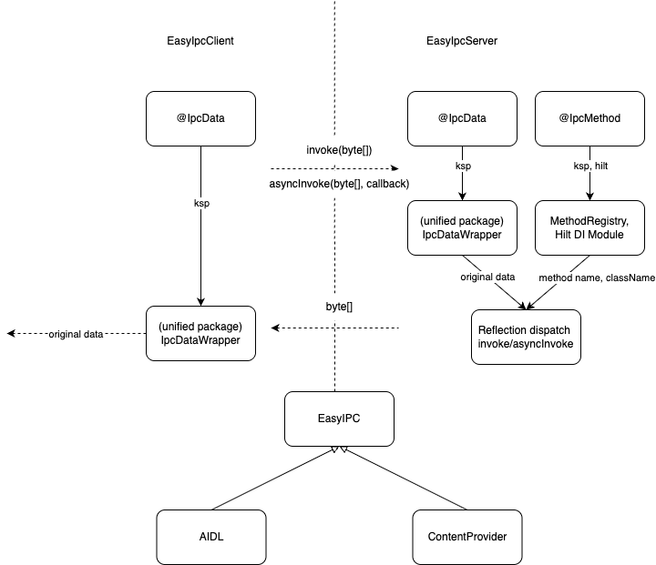

## Android IPC 简易使用框架

### 原理


1. 跨进程调用接口收敛至一个函数`invoke`中，作为跨进程通道，在 Server 端通过参数数据分发调用到真正的接口函数；
2. ksp 注解实现调用接口参数序列化，生成统一包路径下的协议数据包装类，需保证 Client 及 Server
   端都存在对应注解的数据类，作为协议保证，保证 IPC 调用成功；
3. ksp + hilt 实现 Server 端跨进程方法的的映射分发，注解在业务 Server
   端定义跨进程方法，由内部核心模块进行跨进程方法参数的放序列化解析，`invoke`\\`syncInvoke`
   时再根据对应方法进行分发。

### 快速使用

#### 客户端

```kotlin
plugins {
    id("com.google.devtools.ksp") version "2.2.10-2.0.2"// 引入ksp插件
    id("com.google.dagger.hilt.android")
}
```

```kotlin
dependencyResolutionManagement {
    repositoriesMode.set(RepositoriesMode.FAIL_ON_PROJECT_REPOS)
    repositories {
        mavenCentral()
        maven { url = uri("https://jitpack.io") }
    }
}
```

```kotlin
dependencies {
//    implementation("com.github.huanggenghg.EasyIpc:easyipc_transport_aidl_client:v0.0.7") // AIDL 实现
    implementation("com.github.huanggenghg.EasyIpc:easyipc_transport_contentprovider_client:v0.0.7") // ContentProvider实现
    compileOnly("com.github.huanggenghg.EasyIpc:easyipc_processor:v0.0.7")
    ksp("com.github.huanggenghg.EasyIpc:easyipc_processor:v0.0.7")

    // 注入 client 需要
    implementation("com.google.dagger:hilt-android:2.57.1")
    ksp("com.google.dagger:hilt-android-compiler:2.57.1")
}
```

```kotlin
@HiltAndroidApp
class MyApp : Application() // hilt 配置

// 跨进程数据
@IpcData
data class TestCallParams2(val value: Int, val data: String)
@IpcData
data class TestCallResult(val data: String)

@AndroidEntryPoint
class MainActivity : ComponentActivity() {
    //...
    @Inject
    lateinit var easyIpcClient: IEasyIpcClient

    // "同步"调用
    val result = easyIpcClient.invoke("call", TestCallParams2(11, "TestCallParams2"))
    (result as? TestCallResult)?.let
    {
        Log.i(MainActivity.TAG, "client demo ipc invoke result:${it.data}")
    } ?: let
    {
        Log.i(MainActivity.TAG, "client demo ipc invoke result: null!")
    }

    // "异步"调用
    easyIpcClient.asyncInvoke(
    "hello1",
    param = emptyArray(),
    callback =
    object : IEasyIpcDataCallback {
        override fun onCallback(data: Any?) {
            (data as? String)?.let {
                Log.i(MainActivity.TAG, "client demo ipc asyncInvoke result:$it")
            } ?: let {
                Log.i(MainActivity.TAG, "client demo ipc asyncInvoke result: $data!")
            }
        }
    })
}
```

#### 服务端

```kotlin
plugins {
    id("com.google.devtools.ksp") version "2.2.10-2.0.2"// 引入ksp插件
    id("com.google.dagger.hilt.android")
}
```

```kotlin
dependencyResolutionManagement {
    repositoriesMode.set(RepositoriesMode.FAIL_ON_PROJECT_REPOS)
    repositories {
        mavenCentral()
        maven { url = uri("https://jitpack.io") }
    }
}
```

```kotlin
dependencies {
//    implementation("com.github.huanggenghg.EasyIpc:easyipc_transport_aidl:v0.0.7") // AIDL 实现
    implementation("com.github.huanggenghg.EasyIpc:easyipc_transport_contentprovider:v0.0.7") // ContentProvider实现
    compileOnly("com.github.huanggenghg.EasyIpc:easyipc_processor:v0.0.7")
    ksp("com.github.huanggenghg.EasyIpc:easyipc_processor:v0.0.7")

    // 注入 client 需要
    implementation("com.google.dagger:hilt-android:2.57.1")
    ksp("com.google.dagger:hilt-android-compiler:2.57.1")
}
```

```kotlin
@HiltAndroidApp
class MyApp : Application() // hilt 配置

// 跨进程数据
@IpcData
data class TestCallParams2(val value: Int, val data: String)
@IpcData
data class TestCallResult(val data: String)

class TestCallFunc {
    @IpcMethod
    fun hello1(callback: IEasyIpcDataCallback) { // 跨进程方法注册
        Handler(Looper.getMainLooper()).postDelayed({
            callback.onCallback("hello world") 
        }, 5000) // 模拟耗时
    }
}
class TestCallFunc2 {
    @IpcMethod
    private fun call(params2: TestCallParams2) : TestCallResult { // 跨进程方法注册
        return TestCallResult("${params2.data}_ResultForClient")
    }
}
```